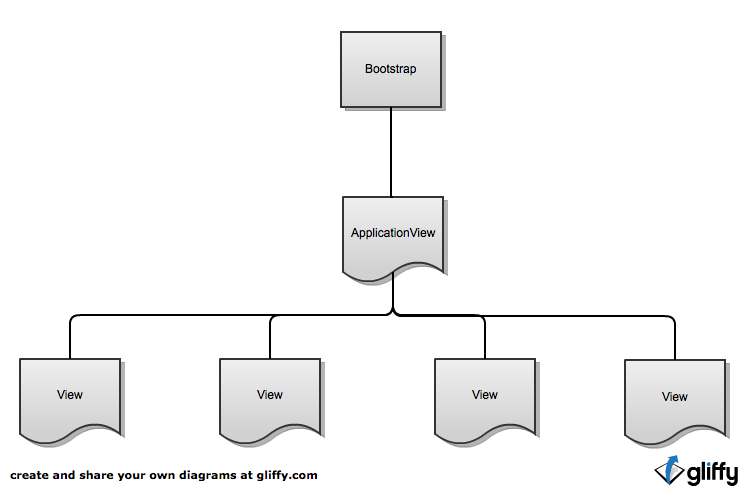
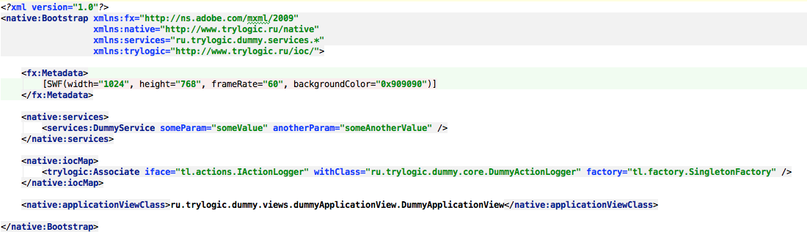

Типичная структура приложения
==========================

Базовая иерархия
--------------------------------------

Bootstrap
~~~~~~~~~~~~~~~~~~~~~~

Это "точка входа" Вашего приложения, а так же его главный класс. 

Рассмотрим типичный пример такого класса (настоятельно рекомендуется использовать MXML для его описания):

Выбор системы отрисовки, используемой фреймворком, осуществляется с помощью указания одного лишь namespace-а для этого класса. В данном примере указано пространство имён "http://www.trylogic.ru/native", что означает, что для отрисовки будет использован стандартный пакет flash.display.*, но, сменив его на, к примеру, "http://www.trylogic.ru/starling", приложение будет отрисовываться уже с помощью Starling Framework-а. Так же Trylogic Framework даёт Вам возможность написать собственные View Adapter-ы для систем отрисовки, которые не идут "в комплекте" (например, Genome2D). 

ApplicationView
~~~~~~~~~~~~~~~~~~~~~~

Это главный View приложения.