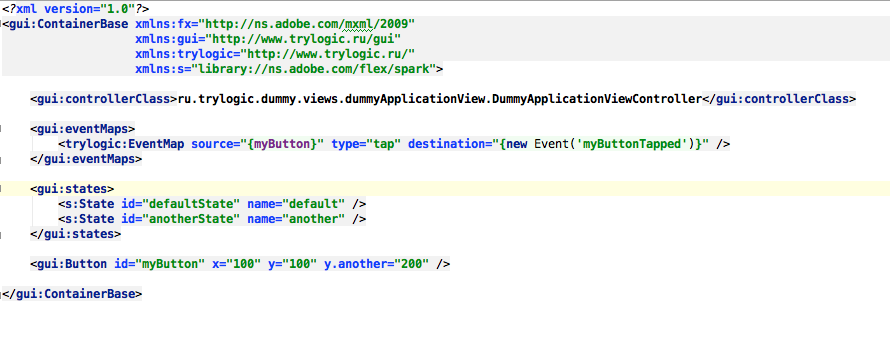

Понятие View
==========================

View - абстракция представления
--------------------------------------

В терминах TrylogicFramework-а, View представляет из себя некую единицу отображения. Так что же представляет из себя View на самом деле? Давайте посмотрим:

.. image:: _static/ViewDescription.png
	:align: center
	
	
ViewController
--------------------------------------

ViewController - это "мозги" вашего вида. Вся логика, весь код, если хотите, хранятся здесь и только здесь. ViewController-ы управляют видом, который им принадлежит, именно они говорят ему, как он должен повести себя (но не как он должен выглядеть).

Для примера возьмём `этот`_ простой вид (для описания View так же используется MXML, хотя вы и можете делать это в Pure AS коде):

.. _`этот`: https://gist.github.com/4013873

Как Вы видите, контроллер вида задаётся явно в виде класса. У одного вида может быть только один контроллер, и наоборот.

Связь с View его контроллер осуществляет с помощью трёх доступных методов:

#. Outlet-ы (в данном примере Button является Outlet-ом с идентификатором ``myButton`` )
#. Посредством наблюдения за Event-ами, которые вид диспатчит (в примере вид задиспачит событие с идентификатором ``myButtonTapped`` при возникновении события ``tap`` на кнопке ``myButton``)
#. Состояния (в нашем View объявленно два состояния с именами ``default`` и ``another``)

Давайте рассмотрим эти методы более детально.

Outlets
~~~~~~~~~~~~~~~~~~~~~~

Понятия аутлетов было взято создателями TF из мира iOS. Они позволяют связать определённую составляющую вида с свойством контроллера. На самом деле, со стороны View аутлеты есть не что иное, как обычные свойства. 