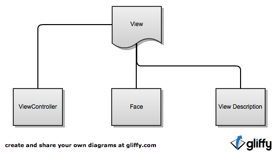

Понятие View
==========================

View - абстракция представления
--------------------------------------

В терминах TrylogicFramework-а, View является единицей отображения. Так что же представляет из себя View на самом деле? Давайте посмотрим:

| 
| 

	
| 
| 
| 
| 
Для примера возьмём этот простой вид (для описания View так же используется MXML, хотя вы и можете делать это в Pure AS коде):

| 
.. code-block:: mxml
	:linenos:

	<?xml version="1.0"?>
	<gui:ContainerBase xmlns:fx="http://ns.adobe.com/mxml/2009"
				   xmlns:gui="http://www.trylogic.ru/gui"
				   xmlns:trylogic="http://www.trylogic.ru/"
				   xmlns:s="library://ns.adobe.com/flex/spark">

		<gui:controllerClass>
			ru.trylogic.dummy.views.dummyApplicationView.DummyApplicationViewController
		</gui:controllerClass>

		<gui:eventMaps>
			<trylogic:EventMap source="{myButton}" type="tap" destination="{new Event('myButtonTapped')}" />
		</gui:eventMaps>

		<gui:states>
			<s:State id="defaultState" name="default" />
			<s:State id="anotherState" name="another" />
		</gui:states>

		<gui:Button id="myButton" x="100" y="100" y.another="200" />

	</gui:ContainerBase>

| 	

Как Вы видите, контроллер вида задаётся явно в виде класса. У одного вида может быть только один контроллер, и наоборот.

Связь с View его контроллер осуществляет с помощью трёх доступных методов:

#. Outlet-ы (в данном примере Button является Outlet-ом с идентификатором ``myButton`` )
#. Посредством наблюдения за Event-ами, которые вид диспатчит (в примере вид задиспачит событие с идентификатором ``myButtonTapped`` при возникновении события ``tap`` на кнопке ``myButton``)
#. Состояния (в нашем View объявленно два состояния с именами ``default`` и ``another``)

Давайте рассмотрим эти методы более детально.

ViewController
--------------------------------------

ViewController - это "мозги" вашего вида. Вся логика, весь код, если хотите, хранятся здесь и только здесь. ViewController-ы управляют видом, который им принадлежит, именно они говорят ему, как он должен повести себя (но не как он должен выглядеть).

Outlets
~~~~~~~~~~~~~~~~~~~~~~

Понятия аутлетов было взято создателями TF из мира iOS. Они позволяют связать определённую составляющую вида с свойством контроллера. На самом деле, со стороны View аутлеты есть не что иное, как обычные свойства. Чтобы получить ссылку на наш аутлет в контроллере, мы должны объявить свойство контроллера с таким же именем и namespace-ом outlet. Примерно вот так:
 
.. code-block:: as3
	:linenos:

	public class DummyApplicationViewController extends ViewController
	{
		outlet var myButton : Button;

		public function DummyApplicationViewController()
		{
		}

		override lifecycle function viewBeforeAddedToStage() : void
		{
			myButton.text = "Click me!";
		}
	}

Просто, не правда ли?
	
Вы можете спросить, как так получилось, мы нигде не объявляли значение этой переменной, как контроллер узнал, что ей надо присвоить значение свойства ``myButton`` из View? Ответ кроется во внутренней реализации контроллера, который при создании View проходится по всем своим outlet-ам и запрашивает их у View. View обязательно должна предоставлять все запрашиваемые outlet-ы, иначе вы получите ошибку.

Вам не надо заботиться о том, что контроллер хранит ссылку на компонент вида, "связывание", как и "отвязывание" outlet-ов происходит автоматически внутри фреймворка.

EventMaps
~~~~~~~~~~~~~~~~~~~~~~